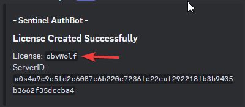

# **Required Json Editing**
Both versions require json to be edited manually. Luckily, its pretty simple.
## **SentinelAntiNuke (Full Version)**
Here is the manual configuration section for SentinelAntiNuke (Full Version)
```json
"plugin": {
    "license": "null",
    "prefix": "§d§lSentinel §8» §7",
    "webhook": "https://discord.com/api/webhooks/id/token",
    "lang": "en-us.json",
    "trustedPlayers": [
      "049460f7-21cb-42f5-8059-d42752bf406f"
    ],
    "antiBan": true,
    "reopCommand": false,
    "pluginHider": true,
    "identifier": "My Server (Edit in main-config.json)"
  }
```

### **Properties that MUST be changed for functionality:**

1. `"license": "null",` replace "null" with the license key given in your ticket. 
    - 
    - it is likley to be your BBB username, unless you are on Dynamic IP Hosts such as Minehut or Aternos.
2. `"webhook": "https://discord.com/api/webhooks/id/token",` Replace "https://discord.com/api/webhooks/id/token" with a discord webhook of your choice.
    - Don't know what a webhook is? Read this [guide](https://support.discord.com/hc/en-us/articles/228383668-Intro-to-Webhooks)
3. `"trustedPlayers": ["049460f7-21cb-42f5-8059-d42752bf406f"],` Replace [my UUID](https://namemc.com/profile/obvWolf.1?q=049460f7-21cb-42f5-8059-d42752bf406f) with your own, or of people you trust.
    - You can add more people to the list by adding a comma and another string
    - `"trustedPlayers": ["049460f7-21cb-42f5-8059-d42752bf406f", "488016ec-679a-489e-9f42-4eb0276761bb"]`
    - Be carefull who's UUID you put here. They will bypass **EVERYTHING** in the plugin, are able to modify the configuration, and OP themselves.

### **Optional Changes**
You can enable the reopCommand option to allow all trusted players to elevate their privileges at any time.
It is great for testing permissions if you don't have an alt.

If you wish to utilize AntiBackdoor there are some requirements.

1. Your host supports custom server Jars.
2. You are willing to put in the extra work for a *marginal at best* security gain.

View [this page](backdoordetection) explaining how to use it.

## **SentinelLite**
Here is the manual configuration section for the Lite version.
```json
"plugin": {
    "prefix": "§d§lSentinel §8» §7",
    "webhook": "https://discord.com/api/webhooks/id/token",
    "lang": "en-us.json",
    "trustedPlayers": [
      "049460f7-21cb-42f5-8059-d42752bf406f"
    ],
    "reopCommand": false,
    "identifier": "My Server (Edit in main-config.json)"
  }
```
### **Properties that MUST be changed for functionality:**

1`"webhook": "https://discord.com/api/webhooks/id/token",` Replace "https://discord.com/api/webhooks/id/token" with a discord webhook of your choice.
   - Don't know what a webhook is? Read this [guide](https://support.discord.com/hc/en-us/articles/228383668-Intro-to-Webhooks)
2`"trustedPlayers": ["049460f7-21cb-42f5-8059-d42752bf406f"],` Replace [my UUID](https://namemc.com/profile/obvWolf.1?q=049460f7-21cb-42f5-8059-d42752bf406f) with your own, or of people you trust.
   - You can add more people to the list by adding a comma and another string
   - `"trustedPlayers": ["049460f7-21cb-42f5-8059-d42752bf406f", "488016ec-679a-489e-9f42-4eb0276761bb"]`
   - Be carefull who's UUID you put here. They will bypass **EVERYTHING** in the plugin, are able to modify the configuration, and OP themselves.

### **Optional Changes**
You can enable the reopCommand option to allow all trusted players to elevate their privileges at any time.
It is great for testing permissions if you don't have an alt.